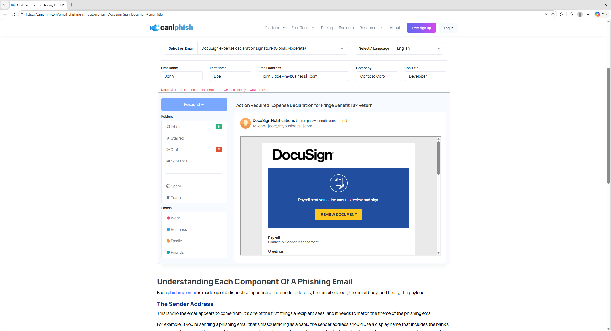
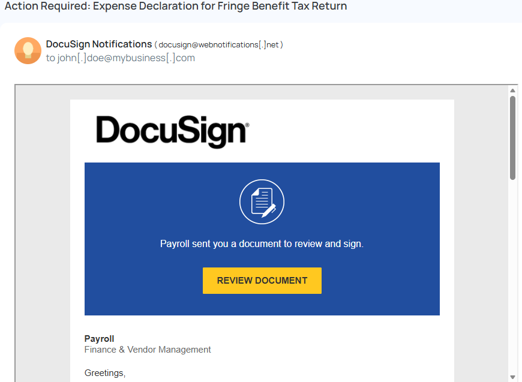
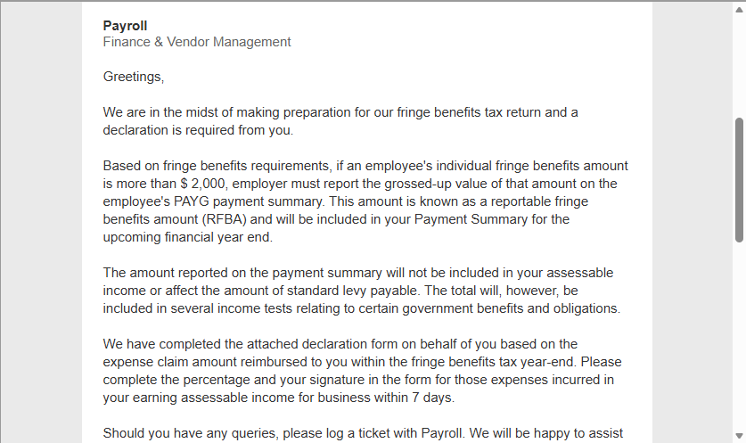
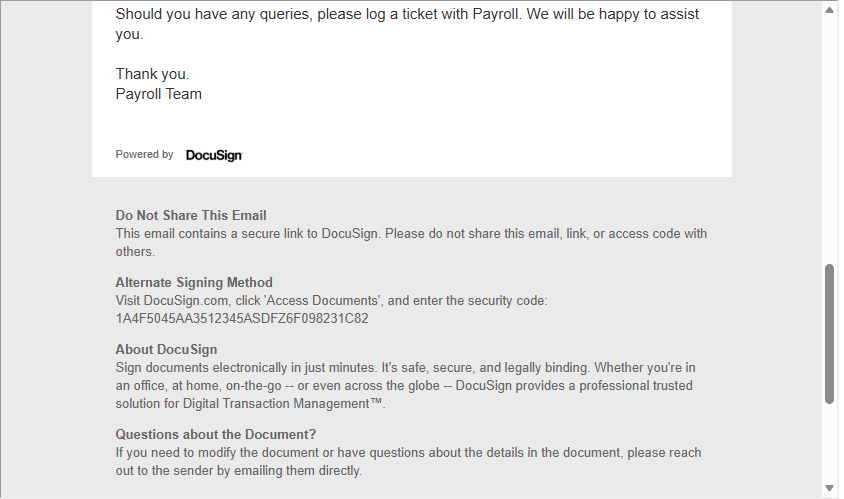
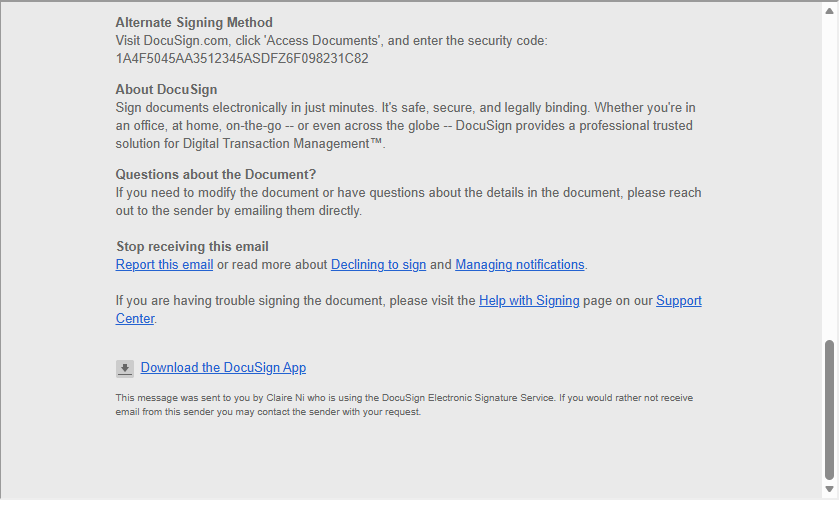
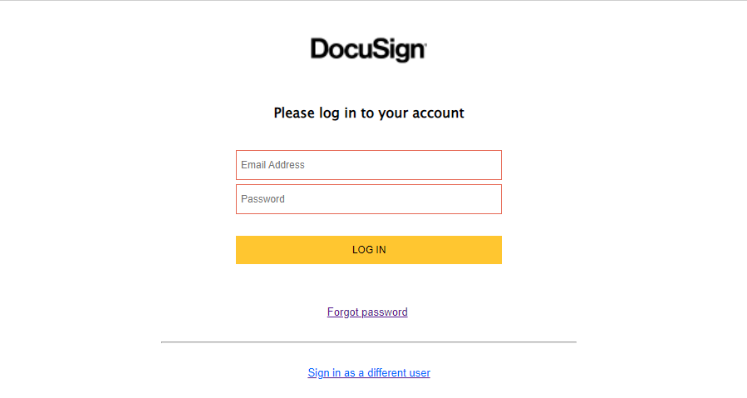
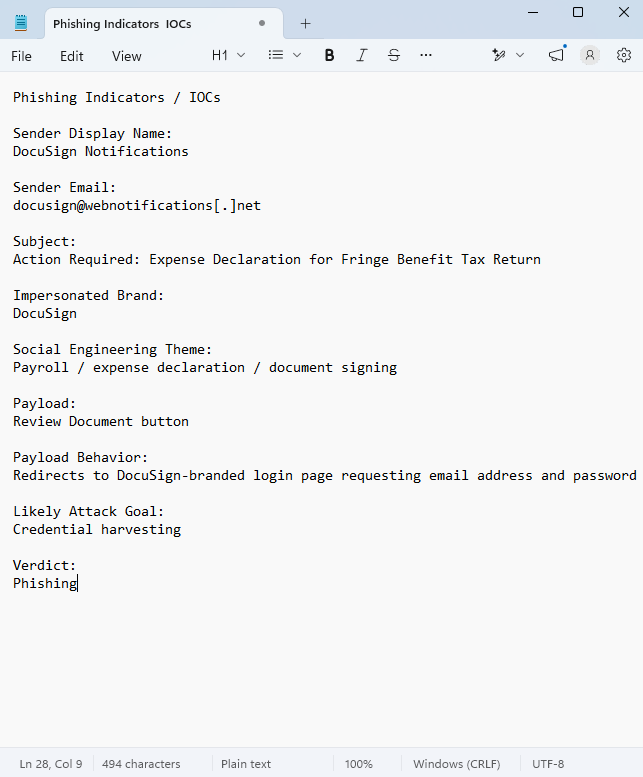

# Phishing Email Analysis Investigation

## Project Overview

This project demonstrates a SOC-style phishing email analysis using a simulated DocuSign phishing email from the CanIPhish Email Phishing Simulator. The investigation focused on reviewing the sender address, email subject, email body, call-to-action button, payload destination, phishing indicators, and final analyst verdict.

---

## Scenario

A simulated DocuSign-themed email was analyzed after appearing to request that a user review and sign a payroll-related document. The email used DocuSign branding, a business-related subject line, and a prominent call-to-action button to encourage the recipient to interact with the message.

---

## Objective

The objective of this project was to identify phishing indicators, analyze the sender and payload behavior, document indicators of compromise, and determine whether the email should be considered suspicious or malicious.

---

## Tools Used

- CanIPhish Email Phishing Simulator
- Manual email inspection
- Screenshot evidence collection
- IOC documentation

---

## Skills Demonstrated

- Phishing email analysis
- Sender address review
- Social engineering identification
- Payload analysis
- Credential harvesting recognition
- IOC documentation
- SOC-style reporting

---

## Investigation Steps

### 1. CanIPhish Simulator Overview

The CanIPhish Email Phishing Simulator was used as a safe training source for this project. The selected scenario was a simulated DocuSign-themed phishing email designed to imitate a document signing request.

---

### 2. DocuSign Phishing Email Overview

The simulated phishing email impersonated DocuSign and attempted to convince the recipient to review and sign a document. The message used trusted branding, a business-related subject line, and a call-to-action button to encourage user interaction.

---

### 3. Sender Address Analysis

The sender display name appeared as “DocuSign Notifications,” but the email address used the domain `webnotifications[.]net` instead of an official DocuSign domain. This mismatch between the display name and sender domain is a common phishing indicator.

---

### 4. Payload and Call-to-Action Analysis

The email used a prominent “Review Document” button to encourage the recipient to interact with the message. This call-to-action is suspicious because it attempts to move the user from the email into an external document review or login workflow.

---

### 5. Email Body and Social Engineering Analysis

The email used a payroll and expense declaration theme to make the request appear legitimate. By referencing payroll, tax return preparation, and document review, the message attempted to create trust and persuade the recipient to click the “Review Document” button.

---

### 6. DocuSign Footer Details

The email included DocuSign-style footer content, alternate signing instructions, and support-related links to make the message appear more legitimate. This type of detail can increase user trust and make phishing emails more convincing.

---

### 7. DocuSign Links and Support Section

The email included additional support and notification-management links that imitated a legitimate DocuSign message. These elements helped the phishing email appear more realistic and reduced suspicion from the recipient.

---

### 8. Payload Destination

After selecting the “Review Document” button, the user was redirected to a DocuSign-branded login page requesting an email address and password. This behavior indicates a likely credential harvesting attempt, where the attacker attempts to collect user login credentials through a fake authentication page.

---

### 9. IOC Summary

The phishing indicators and investigation findings were documented in an IOC summary. The email impersonated DocuSign, used a suspicious sender domain, relied on payroll-related social engineering, and redirected the user to a credential collection page.

---

## Indicators of Compromise

| Indicator Type | Value |
|---|---|
| Sender Display Name | DocuSign Notifications |
| Sender Email | docusign@webnotifications[.]net |
| Sender Domain | webnotifications[.]net |
| Subject Line | Action Required: Expense Declaration for Fringe Benefit Tax Return |
| Impersonated Brand | DocuSign |
| Social Engineering Theme | Payroll / expense declaration / document signing |
| Payload | Review Document button |
| Payload Behavior | Redirects to DocuSign-branded login page requesting credentials |
| Likely Attack Goal | Credential harvesting |

---

## Key Findings

- The email impersonated DocuSign using trusted branding.
- The sender domain did not match an official DocuSign domain.
- The subject line used a business-related payroll theme to appear legitimate.
- The email encouraged the user to click a “Review Document” button.
- The payload destination requested an email address and password.
- The behavior was consistent with a credential harvesting phishing attempt.

---

## Analyst Verdict

The email was determined to be phishing. The combination of brand impersonation, sender domain mismatch, social engineering language, suspicious call-to-action, and credential collection behavior indicates that the message was designed to steal user login credentials.

---

## Recommended Response

- Do not click the link or submit credentials.
- Report the email to the security team or phishing mailbox.
- Block or monitor the suspicious sender domain if confirmed malicious in a real environment.
- Search for similar emails across the environment.
- Educate users on DocuSign-themed phishing attempts.
- If credentials were entered, reset the affected user’s password and review sign-in activity.

---

## Conclusion

This project demonstrated how a SOC analyst can review a suspicious email, identify phishing indicators, analyze payload behavior, document IOCs, and provide a final verdict. The simulated DocuSign email showed multiple signs of phishing and was assessed as a likely credential harvesting attempt.
